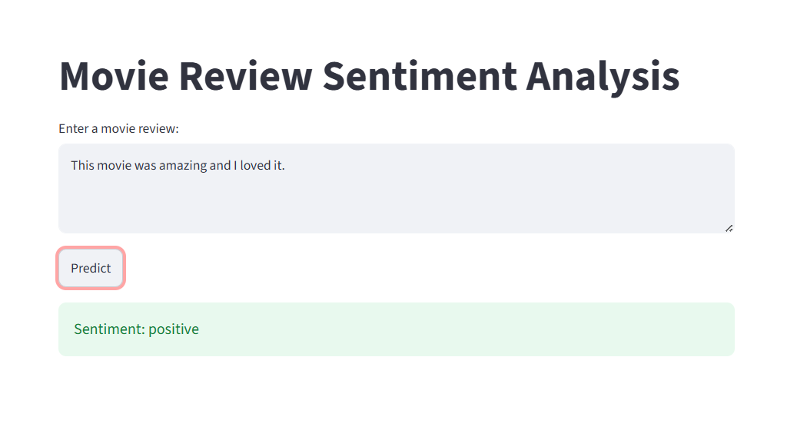
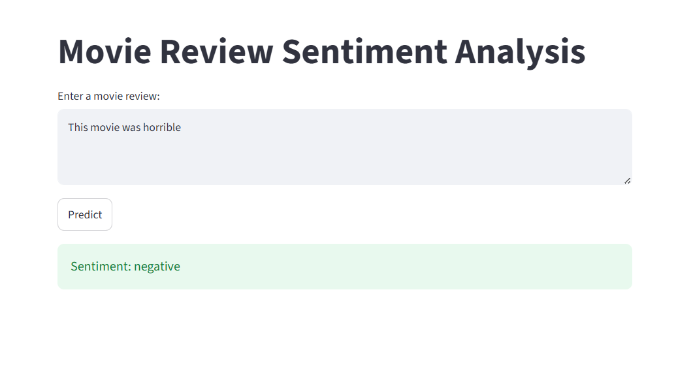

# 🎬 Movie Review Sentiment Analysis

A Machine Learning project that predicts whether a movie review is **Positive** or **Negative** using Natural Language Processing (NLP).

## Features

- Text preprocessing and cleaning
- TF-IDF vectorization
- Logistic Regression model
- Real-time sentiment prediction using Streamlit

## Technologies Used

- Python
- Pandas
- Scikit-learn
- Streamlit

## Dataset

This project uses the **IMDb Movie Reviews Dataset (50K Reviews)** from Kaggle.

Download the dataset from:
https://www.kaggle.com/datasets/lakshmi25npathi/imdb-dataset-of-50k-movie-reviews

After downloading, place the dataset inside:

```text
dataset/IMDB Dataset.csv
```

## How to Run

Install the required libraries:

```bash
pip install -r requirements.txt
```

Run the application:

```bash
streamlit run app.py
```

## Project Workflow

1. Load IMDb dataset
2. Clean and preprocess text
3. Convert text to numerical features using TF-IDF
4. Train a Logistic Regression model
5. Train a Logistic Regression classifier
6. Predict sentiment for new movie reviews using the Streamlit web application

---

## Application Screenshots

### Positive Prediction



### Negative Prediction



